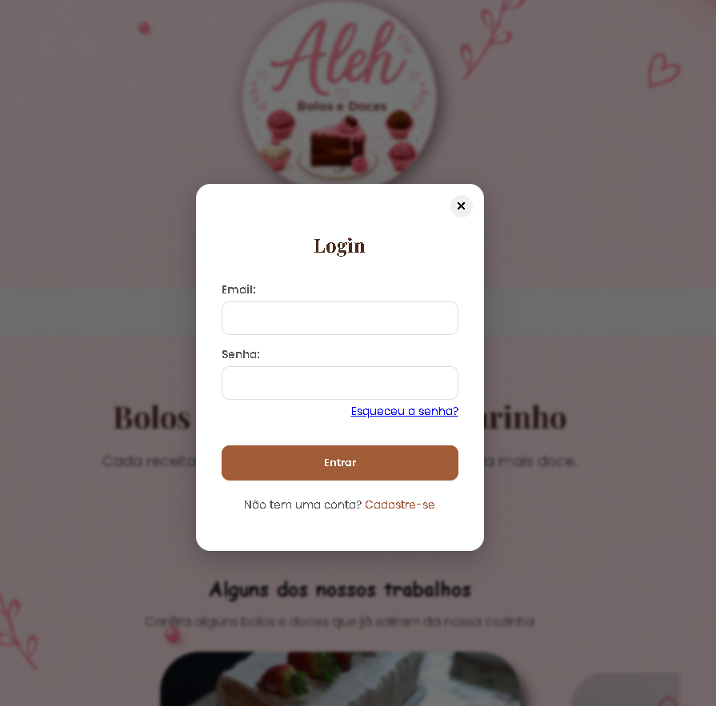
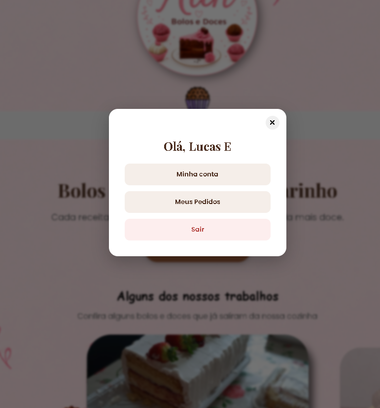
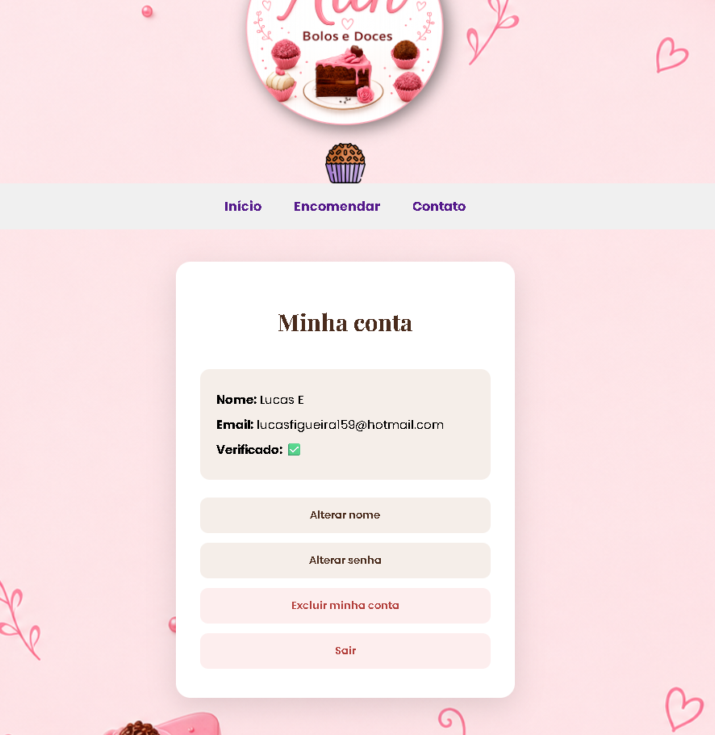
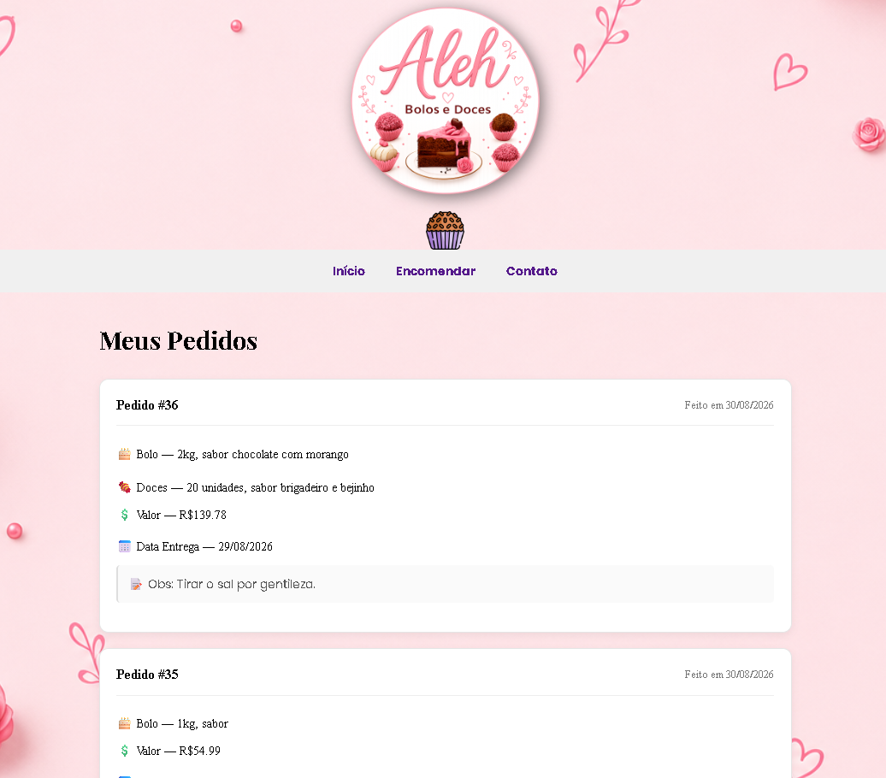
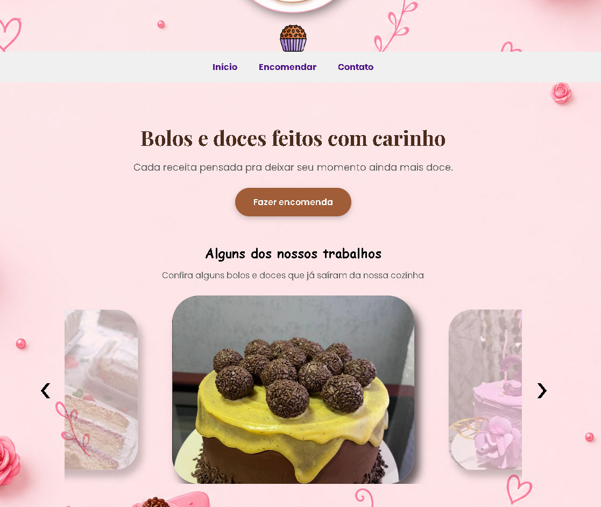
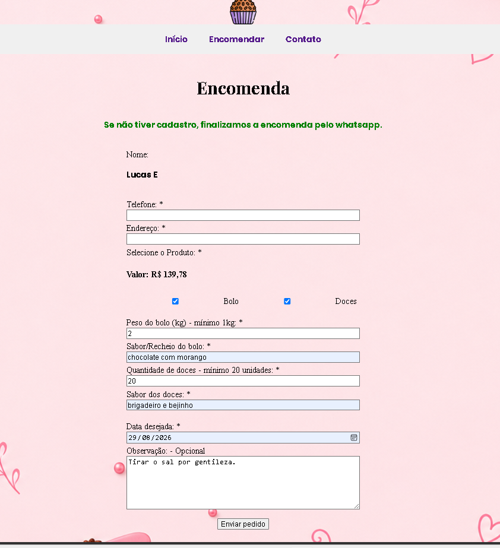

# 🍰 Aleh Bolos e Doces

Site institucional e de encomendas para uma confeitaria, desenvolvido em **PHP puro + MySQL**, com sistema completo de contas de usuário (cadastro, login, verificação de e-mail, recuperação de senha) e um formulário de encomenda que gera automaticamente uma mensagem formatada para o WhatsApp da loja.

Projeto desenvolvido como estudo prático de PHP, com foco em fundamentos de back-end (sessões, banco de dados, e-mail transacional) sem o uso de frameworks.

---

## 🗂️ Estrutura do projeto

```text
├── index.php                 # Página inicial
├── pages/                    # Páginas organizadas por finalidade
│   ├── auth/                 # Cadastro, confirmação e recuperação de senha
│   ├── usuario/              # Minha conta e alterações de dados
│   └── encomendas/           # Encomendas e contato
├── actions/                  # Processamento dos formulários
├── includes/                 # Conexão, CSRF e componentes compartilhados
├── js/                       # JavaScript
├── img-galeria/              # Imagens da galeria
├── img-icones/               # Ícones
├── img-logo/                 # Logo e fundo
├── img-portfolio/            # Imagens usadas no portfólio/README
├── screenshots/              # Capturas adicionais
├── vendor/                   # Dependências do Composer
├── .env.example
├── composer.json
└── README.md
```

## 📸 Screenshots

<table>
  <tr>
    <td align="center"><b>Login</b></td>
    <td align="center"><b>Usuário logado</b></td>
    <td align="center"><b>Minha conta</b></td>
    <td align="center"><b>pedido</b></td>
    <td align="center"><b>inicio</b></td>
    <td align="center"><b>encomenda</b></td>
    <td align="center"><b>contato</b></td>
    

  </tr>
  <tr>
    <td></td>
    <td></td>
    <td></td>
    <td></td>
    <td></td>
    <td></td>
    <td></td>
    
  </tr>
</table>

---

## ✨ Funcionalidades

### Site institucional
- Página inicial com galeria de fotos dos trabalhos (carrossel de imagens)
- Página de contato com atalhos diretos para WhatsApp e Instagram

### Contas de usuário
- Cadastro com confirmação de e-mail por código (enviado via SMTP/Gmail)
- Login com verificação de senha (hash com `password_hash`/`password_verify`)
- Reenvio automático do código de confirmação caso o cliente tente logar sem ter confirmado o e-mail
- Recuperação de senha ("Esqueci minha senha") por código enviado por e-mail
- Alteração de senha para usuários logados (exige a senha atual)
- Página "Minha conta": nome, e-mail e status de verificação, com opções de:
  - Alterar nome
  - Excluir conta (exige confirmação com a senha atual)
  - Sair (logout)

### Encomendas
- Formulário de encomenda com nome pré-preenchido automaticamente se o cliente estiver logado
- Seleção de produtos (Bolo e/ou Doces), com regras de negócio:
  - Bolo: peso mínimo de 1kg e campo de sabor/recheio
  - Doces: quantidade mínima de 20 unidades e campo de sabor
- Validação de campos obrigatórios em tempo real (JavaScript) e no servidor
- Ao enviar, gera automaticamente uma mensagem formatada e redireciona para o WhatsApp da loja com o pedido pronto — sem necessidade de um sistema de pedidos completo

### Segurança
- Senhas de usuário armazenadas com hash (nunca em texto puro)
- Proteção contra SQL Injection com *prepared statements* (`mysqli`) em todas as consultas
- Mensagens de erro de login genéricas (não revelam se o e-mail existe ou não na base)
- Fluxo de recuperação de senha que também não revela se um e-mail está cadastrado
- Ações sensíveis (excluir conta, alterar senha) exigem confirmação da senha atual
- Proteção contra CSRF (Cross-Site Request Forgery): todo formulário que executa uma ação envia um token de sessão que o servidor confere antes de processar o pedido
- Credenciais (banco de dados e SMTP) isoladas em arquivo `.env`, fora do controle de versão

---

## 🛠️ Tecnologias utilizadas

| Camada | Tecnologia |
|---|---|
| Back-end | PHP (procedural, sem framework) |
| Banco de dados | MySQL (via extensão `mysqli`, com *prepared statements*) |
| E-mail transacional | [PHPMailer](https://github.com/PHPMailer/PHPMailer) via SMTP (Gmail) |
| Configuração/segredos | [vlucas/phpdotenv](https://github.com/vlucas/phpdotenv) (arquivo `.env`) |
| Front-end | HTML5, CSS3, JavaScript puro (vanilla JS) |
| Gerenciador de dependências | Composer |
| Ambiente local | XAMPP (Apache + MySQL) |

---

## 🗂️ Estrutura do banco de dados

Tabela `cliente`:

| Campo | Tipo | Descrição |
|---|---|---|
| `id` | INT (PK) | Identificador do cliente |
| `nome` | VARCHAR | Nome do cliente |
| `email` | VARCHAR | E-mail (único, usado no login) |
| `senha` | VARCHAR | Hash da senha (`password_hash`) |
| `email_verificado` | TINYINT | 0 = pendente, 1 = confirmado |
| `codigo_verificacao` | VARCHAR | Código temporário (confirmação de e-mail ou recuperação de senha) |
| `codigo_expira` | DATETIME | Validade do código (15 minutos) |

---

## 🚀 Como rodar localmente

1. Clone o repositório e coloque a pasta dentro de `htdocs` (XAMPP) ou equivalente.
2. Instale as dependências PHP:
   ```
   composer install
   ```
3. Crie um banco de dados MySQL e importe a estrutura da tabela `cliente` (ver acima).
4. Copie `.env.example` para `.env` e preencha com suas credenciais:
   ```
   DB_HOST=localhost
   DB_USER=root
   DB_PASS=
   DB_NAME=nome_do_banco

   MAIL_HOST=smtp.gmail.com
   MAIL_PORT=587
   MAIL_USERNAME=seu_email@gmail.com
   MAIL_PASSWORD="sua senha de app do gmail"
   ```
   > A senha do Gmail deve ser uma **senha de app** (não a senha normal da conta), gerada nas configurações de segurança do Google.
5. Inicie o Apache e o MySQL (via XAMPP) e acesse `http://localhost/nome-da-pasta/index.php`.

---

## 📌 Possíveis próximos passos

- Painel administrativo para a loja visualizar e gerenciar encomendas direto no banco (hoje elas só são enviadas via WhatsApp)
- Upload de imagem de referência na encomenda (o layout já tem espaço reservado para isso)
- Separação adicional de componentes e regras de negócio em módulos conforme o projeto crescer
- Estilização visual mais completa (o foco desta versão foi a lógica e a segurança do back-end)

---

*Projeto em desenvolvimento contínuo como estudo de PHP e boas práticas de back-end.*
